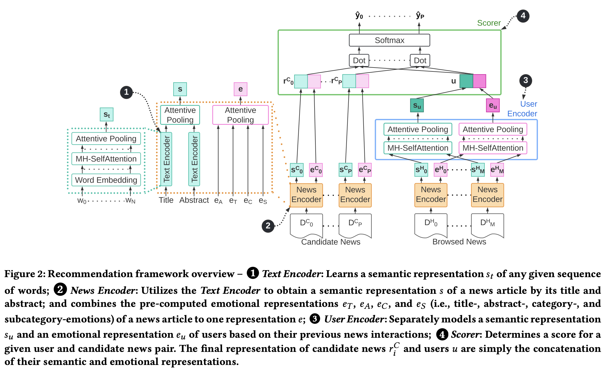

# EmoRec 👋 

**Exploring Expressed Emotions for Neural News Recommendation**<br/>
Mete Sertkan and Julia Neidhardt<br/>
[https://doi.org/10.1145/3511047.3536414](https://doi.org/10.1145/3511047.3536414)

**tldr;**  We propose a neural news recommendation model that incorporates expressed emotions within news articles to improve recommendation performance. Our approach disentangles semantic and emotional modeling of news articles and users, using textual content for semantic representation and emotions for emotional representation. Offline experiments on a real-world dataset show our approach outperforms non-emotion-aware solutions significantly. We plan to investigate online performance and explainability/explorability of our approach in the future.



Please feel free to use our source code and let us know if you have any questions or feedback ([mete.sertkan@tuwien.ac.at](mailto:mete.sertkan@tuwien.ac.at) or dm to [@m_sertkan](http://twitter.com/m_sertkan)).

**Please cite our work as:**
```
@inproceedings{sertkan2022_exploring,
	title        = {Exploring Expressed Emotions for Neural News Recommendation},
	author       = {Sertkan, Mete and Neidhardt, Julia},
	year         = 2022,
	booktitle    = {Adjunct Proceedings of the 30th ACM Conference on User Modeling, Adaptation and Personalization},
	location     = {Barcelona, Spain},
	publisher    = {Association for Computing Machinery},
	address      = {New York, NY, USA},
	series       = {UMAP '22 Adjunct},
	pages        = {22–28},
	doi          = {10.1145/3511047.3536414},
	isbn         = 9781450392327,
	url          = {https://doi.org/10.1145/3511047.3536414},
	numpages     = 7,
	keywords     = {news recommendation, neural networks, emotions, diversity}
}
```

<br/>

**On the Effect of Incorporating Expressed Emotions in News Articles on Diversity within Recommendation Models**<br/>
Mete Sertkan and Julia Neidhardt<br/>
[https://ceur-ws.org/Vol-3561/paper5.pdf](https://ceur-ws.org/Vol-3561/paper5.pdf)

**tldr;**  Despite news articles being highly edited and trimmed to maintain a neutral and objective tone, there are still stylistic residues of authors like expressed emotions, which impact the decision-making of users whether or not to consume the recommended articles. In this study, we delve into the effects of incorporating emotional signals within the 𝐸𝑚𝑜𝑅𝑒𝑐 model on both emotional and topical diversity in news recommendations. Our findings show a nuanced alignment with users’ preferences, leading to less diversity and potential creation of an “emotion chamber.” However, it is crucial to model these emotional dimensions explicitly rather than implicitly as contemporary deep-learning models do. This approach offers the opportunity to communicate and raise awareness about the reduction in diversity, allowing for interventions if necessary. We further explore the complex distinction between intra-list and user-centric diversity, sparking a critical debate on guiding user choices. Overall, our work emphasizes the importance of a balanced, ethically-grounded approach, paving the way for more informed and diverse news consumption.

**Please cite our work as:**
```
@article{sertkan2023effect,
	title        = {On the Effect of Incorporating Expressed Emotions in News Articles on Diversity within Recommendation Models},
	author       = {Sertkan, Mete and Neidhardt, Julia},
	year         = 2023,
	journal      = {decision-making},
	volume       = 3,
	pages        = 11
}
```

# Setup

## Requirements
In our implementations we use the combo pytorch - pytorchlighnting - torchmetrics. Thus, a cuda device is suggested and more are even better! We are using conda and have exported the conda-environment we are working with, thus: 
1. Install [conda](https://docs.conda.io/en/latest/)
2. Create an environment with the provided environment.yml:

    ```
    conda env create -n emorec --file environment.yml
    ```
3. Activate the environment as following: 
    ```
    conda activate emorec
    ```

## Data
Change to the data folder (e.g., ``cd project/data``) and run prep.sh. 
```
bash prep.sh
```
This will create necessary folders, download the [MIND dataset](https://msnews.github.io), download glove embeddings, preprocess the data, and create train & test sets. 

## Config
We provide for each of the utilized emotion taxonomies, a config file under ``project/config/model/emorec/_taxonomy_name_``. The config files contain general information, hyperparameters (which we have obtained), meta-information (logging, checkpointing, ...). Please, change the config according to your needs. You may want to change the paths to: i) train/test - data; ii) directory for the checkpoints; iii) directory for the logging. You may consider to set ``fast_dev_run`` to ``True`` for a quick check if everything runs smoothly. 

# RUN
Switch to the project folder, e.g., ``cd ..`` if you currently are in the ``project/data`` folder. 

## Train
Use  ``train.py`` to start training EmoRec with the chosen configuration as following: 
```
CUDA_VISIBLE_DEVICES=0,1 train.py --config config/model/emorec/goemotions.yaml
```
With ``CUDA_VISIBLE_DEVICES=ids`` you can define on which CUDA devices to train. If you do not define any device all visible devices will be used. 

Currently ``train.py`` saves the last checkpoint and the one of best three epochs (can be configured) based on validation-AUC. In case of an interruption it attempts a gracefull shutdown and saves the checkpoint aswell. You can resume training by providing a path to a checkpoint with  ``--resume`` like: 
```
CUDA_VISIBLE_DEVICES=0,1 train.py --config config/model/emorec/goemotions.yaml --resume _path_to_checkpoint_
```

## Test
For Testing use the same config as you have trained, since it contains all necessary information, e.g., path to test data, config of test-dataloader, logging info, etc. It may take longer, but use only ONE GPU for testing (e.g., ``CUDA_VISIBLE_DEVICES=_one_gpu_id_of_your_choice_``). Only test once, right before you report/submit (after validation, tuning, ...). You have to provide a checkpoint of your choice (e.g., best performing hyperparam setting according to val, etc.) and can run a test as following:
```
CUDA_VISIBLE_DEVICES=0 test.py --config config/model/emorec/goemotions.yaml --ckpt path_to_ckpt_of_your_choice
```

## Monitoring
We use the default logger of pytorch-lightning, i.e., tensorboard. You can monitor your traning, validation, and testing via tensorboard. You have to provide the path of your logs and can start tensorboard as following: 
```
tensorboard --logdir _path_to_tensorboard_logdir_
```

